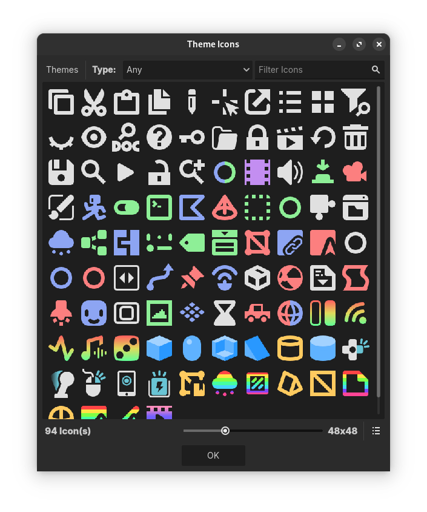

#  IconTexture

A texture that draws an icon of a Theme resource.

> [!TIP]
> This add-on has built-in documentation, usage instructions and references can be consulted directly in the Godot editor via the  **Search Help** (``F1``).
